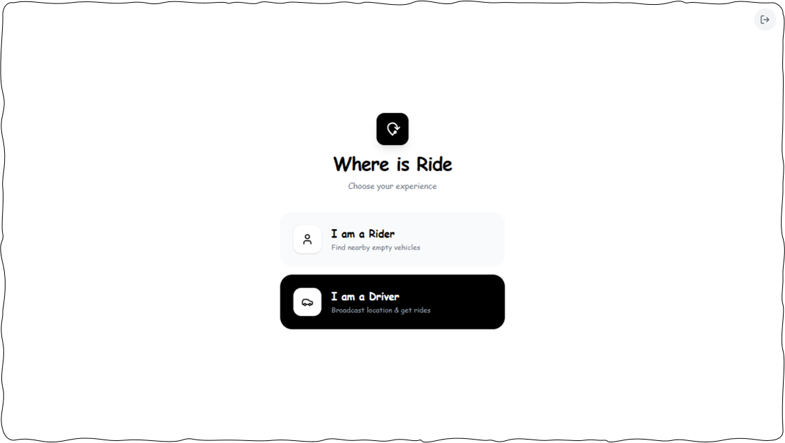

# Where is Ride
**Know exactly where your ride is.**

* Stop guessing when your vehicle will arrive. Where is Ride gives you live location, real-time status, and instant alerts, all in one clean app.

* A real-time vehicle tracking app for Android. See where your ride is before it arrives.

[](https://heysanzu.github.io/WhereIsRide/)
[](https://github.com/heysanzu/sanzuShielder/releases/download/WhereIsRide_v1.0/WhereIsRide.apk)



---  

```bash
git clone https://github.com/heysanzu/WhereIsRide.git
cd WhereIsRide
```
<p align="left">
  
</p>

Maintained by [@heysanzu](https://github.com/heysanzu)
